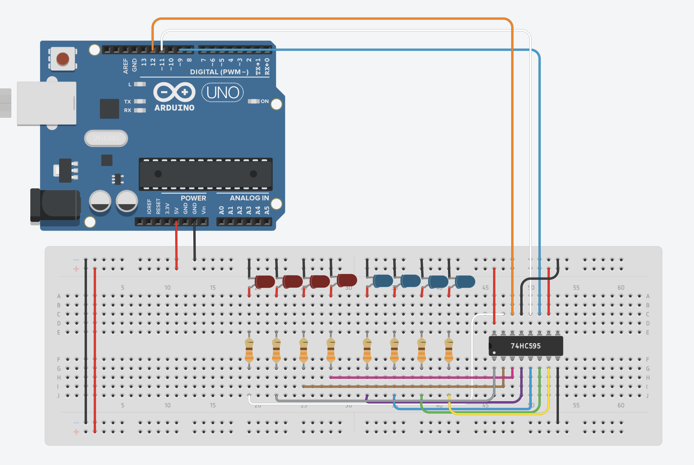

# 8-Bit Binary Counter with Shift Register

An 8-bit binary counter (0–255) using only 3 Arduino pins via a 74HC595 shift register.

---

## Circuit

### Components
- Arduino Uno
- 1x 74HC595 Shift Register
- 8x LED (4x red, 4x blue)
- 8x 220Ω Resistor
- Breadboard + Jumper Wires

### Connections
| Arduino Pin | 74HC595 Pin | Function |
|-------------|-------------|----------|
| Pin 11 | ST_CP (12) | Latch |
| Pin 9 | SH_CP (11) | Clock |
| Pin 12 | DS (14) | Data |
| 5V | VCC (16), MR (10) | Power |
| GND | GND (8), OE (13) | Ground |

---

## How It Works

Instead of using 8 separate Arduino pins, data is sent serially to the 74HC595 using only data, clock, and latch pins. The shift register converts this serial input into 8 parallel outputs, each lighting an LED.

The latch pin controls when the outputs update: pulled LOW during data transfer, then HIGH to push the new state to all 8 output pins.

---

## [Comparison with 4-Bit Counter](https://github.com/Fwoopr/binary-counter)

| | 4-Bit Counter | 8-Bit Counter |
|---|---|---|
| Arduino pins used | 4 | **3** |
| LEDs controlled | 4 | **8** |
| Method | Direct `digitalWrite` | Shift register via `shiftOut()` |
| Count range | 0–15 | **0–255** |

---

## Skills
`Arduino` `C++` `Shift Register` `SPI` `Digital Logic` `Embedded Systems`
